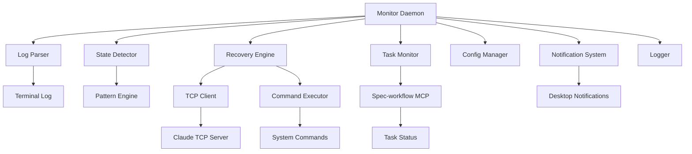

# Design Document

## Overview

The Claude Auto-Recovery System is a real-time monitoring and recovery daemon that operates as a standalone process alongside Claude Code. It leverages the expect-based TCP control framework to monitor Claude's terminal output, detect various execution states, and automatically perform recovery actions. The system integrates with the spec-workflow MCP to intelligently terminate monitoring when all tasks are complete, optimizing resource usage.

## Steering Document Alignment

### Technical Standards (tech.md)
No steering documents exist yet. Design follows language-agnostic best practices with emphasis on:
- Cross-platform compatibility (Linux/macOS/Windows WSL)
- Minimal external dependencies
- Standard system tools and protocols
- Modular, testable architecture

### Project Structure (structure.md)  
No project structure document exists. Design follows conventional daemon/service organization:
- Clear separation between monitoring, detection, and recovery components
- Configuration-driven behavior
- Standard logging and service management patterns

## Code Reuse Analysis

### Existing Components to Leverage
- **expect framework**: Foundation TCP control interface from blog post (`claude-code-bridge.exp`)
- **Standard system tools**: `tail`, `grep`, `awk` for log processing
- **MCP tools**: spec-workflow integration for task status queries
- **TCP sockets**: Existing localhost communication protocol

### Integration Points
- **spec-workflow MCP**: Task status queries via command-line tools
- **Claude Code terminal**: Log monitoring via `/tmp/claude-code-terminal.log`
- **TCP interface**: Command injection via localhost:9999 socket
- **System notifications**: Desktop notifications via `notify-send` or equivalent
- **Configuration system**: YAML/JSON configuration files

## Architecture

The system follows an event-driven monitoring architecture with clear separation of concerns. The main monitoring loop orchestrates specialized modules for log parsing, state detection, recovery actions, and task completion checking.

### Modular Design Principles
- **Single File Responsibility**: Each module handles one domain (monitoring, detection, recovery, config)
- **Component Isolation**: State detection, TCP communication, and recovery logic are independent
- **Service Layer Separation**: Clear boundaries between data collection, business logic, and action execution
- **Utility Modularity**: Log parsing, pattern matching, and notification utilities are standalone



## Components and Interfaces

### Monitor Daemon (Core Orchestrator)
- **Purpose:** Main event loop coordinating all monitoring and recovery activities
- **Interfaces:** `start()`, `stop()`, `get_status()`, `reload_config()`
- **Dependencies:** All other components, configuration manager
- **Reuses:** Standard daemon patterns, signal handling

### Log Parser
- **Purpose:** Real-time parsing of Claude Code terminal output with pattern detection
- **Interfaces:** `parse_log_line(line)`, `get_recent_context(lines)`, `detect_patterns(text)`
- **Dependencies:** File system access, pattern engine
- **Reuses:** Standard file monitoring (inotify/fsevents), regex libraries

### State Detector  
- **Purpose:** Analyze parsed logs to detect Claude execution states (idle, input-waiting, context-pressure, error)
- **Interfaces:** `detect_state(context)`, `get_confidence_score(state)`, `prioritize_states(states)`
- **Dependencies:** Log parser output, pattern definitions
- **Reuses:** Pattern matching utilities, state machine concepts

### Recovery Engine
- **Purpose:** Execute appropriate recovery actions based on detected states
- **Interfaces:** `execute_recovery(state, context)`, `send_command(cmd)`, `wait_for_ready()`
- **Dependencies:** TCP client, command executor, state detector
- **Reuses:** Existing TCP protocol from expect framework

### Task Monitor
- **Purpose:** Integration with spec-workflow to track task completion and trigger monitoring termination  
- **Interfaces:** `check_task_status()`, `get_pending_tasks()`, `is_work_complete()`
- **Dependencies:** spec-workflow MCP tools, system command execution
- **Reuses:** MCP command-line interfaces, JSON parsing

### TCP Client
- **Purpose:** Communication with Claude Code via existing TCP interface
- **Interfaces:** `send_message(msg)`, `connect()`, `is_connected()`
- **Dependencies:** Network socket libraries
- **Reuses:** TCP protocol from claude-code-bridge.exp

### Config Manager
- **Purpose:** Load, validate, and manage system configuration
- **Interfaces:** `load_config(path)`, `get_setting(key)`, `validate_config()`
- **Dependencies:** File system, YAML/JSON parsing
- **Reuses:** Standard configuration patterns

### Notification System
- **Purpose:** Send alerts and status updates to user
- **Interfaces:** `send_notification(msg, type)`, `log_event(event)`
- **Dependencies:** Desktop notification APIs, logging framework
- **Reuses:** System notification services (notify-send, etc.)

## Data Models

### MonitorState
```python
{
    "current_state": "idle|input-waiting|context-pressure|error|completed",
    "confidence": 0.0-1.0,
    "last_activity": timestamp,
    "context_lines": [string],
    "recovery_attempts": int,
    "task_status": TaskStatus
}
```

### TaskStatus  
```python
{
    "total_tasks": int,
    "pending_tasks": int,
    "in_progress_tasks": int,
    "completed_tasks": int,
    "work_complete": boolean,
    "last_checked": timestamp
}
```

### RecoveryAction
```python
{
    "action_type": "compact|resume|input|notify",
    "command": string,
    "parameters": dict,
    "timeout": int,
    "retry_count": int
}
```

### Configuration
```yaml
monitoring:
  idle_timeout: 30
  input_timeout: 5  
  context_pressure_timeout: 10
  task_check_interval: 30
  completion_cooldown: 60

recovery:
  max_retries: 3
  retry_backoff: 2.0
  compact_timeout: 30

logging:
  level: "INFO"
  file: "/var/log/claude-monitor.log"
  console: true
  max_size_mb: 100

notifications:
  desktop: true
  log_actions: true
  
tcp:
  host: "localhost"
  port: 9999
  connection_timeout: 5
```

## Error Handling

### Error Scenarios

1. **TCP Connection Failed**
   - **Handling:** Retry connection with exponential backoff, fallback to user notification
   - **User Impact:** Warning notification, monitoring continues in read-only mode

2. **Log File Access Error**
   - **Handling:** Wait for file availability, create if missing, check permissions
   - **User Impact:** Error notification with troubleshooting steps

3. **Spec-workflow MCP Unavailable**
   - **Handling:** Disable task completion monitoring, log warning, continue basic monitoring
   - **User Impact:** Information notification, manual monitoring termination required

4. **Recovery Command Execution Failed**
   - **Handling:** Log error, increment retry counter, try alternative recovery strategies
   - **User Impact:** Warning notification with manual intervention suggestion

5. **Configuration File Invalid**
   - **Handling:** Load defaults, log validation errors, continue with safe configuration
   - **User Impact:** Warning notification with config file path and error details

## Testing Strategy

### Unit Testing
- State detection pattern matching with various log samples
- Configuration validation with valid/invalid configurations
- TCP client connection handling and message formatting
- Task status parsing and completion detection logic
- Recovery action parameter validation and timeout handling

### Integration Testing
- End-to-end log monitoring with simulated Claude Code output
- TCP communication with actual expect-based bridge
- spec-workflow MCP integration with real task status queries
- Desktop notification delivery across different platforms
- Configuration reloading without service interruption

### End-to-End Testing
- Complete workflow: monitoring startup → state detection → recovery → task completion → shutdown
- Stress testing with high-frequency log updates and state changes
- Error recovery scenarios with network failures and file system issues
- Multi-hour monitoring sessions with various Claude Code usage patterns
- Resource usage validation under different load conditions