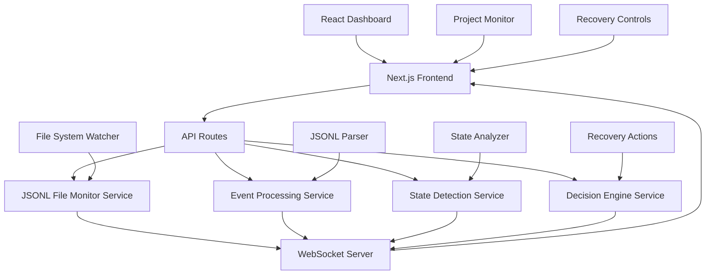

# Design Document

## Overview

The divide and conquer refactor pivots from the existing Python-based monitoring system to a modern **Next.js full-stack application** that leverages Claude Code's structured JSONL logs. This design transforms the monitoring approach into a sophisticated web-based dashboard that provides real-time visualization, intelligent notifications, and interactive recovery controls.

The Next.js application will monitor `~/.claude/projects/*/` directories, process structured conversation events through TypeScript APIs, and provide a React-based dashboard for monitoring Claude's activity across multiple projects. This approach eliminates complex terminal parsing while delivering modern web features like real-time updates, responsive UI, and advanced data visualization.

## Steering Document Alignment

### Technical Standards (tech.md)
*Following modern web development best practices:*

- **TypeScript First**: Strong typing for JSONL event processing and state management
- **Component Architecture**: React components with clear separation of concerns
- **API Design**: RESTful and WebSocket APIs for real-time monitoring
- **Testing Framework**: Jest/Vitest for unit tests, Playwright for E2E testing

### Project Structure (structure.md)
*Modern Next.js 14+ structure with App Router:*

- **File-based Routing**: App directory structure for API routes and pages
- **Component Organization**: Shared components, layouts, and feature-specific modules
- **Server Components**: Leverage Next.js server components for efficient data fetching
- **Type Safety**: Comprehensive TypeScript integration throughout

## Code Reuse Analysis

### Existing Components to Extract
- **Configuration Patterns**: Extract monitoring logic and decision-making patterns from Python codebase
- **State Detection Logic**: Transform Python state detection into TypeScript algorithms  
- **Recovery Strategies**: Convert Python recovery actions into Next.js API endpoints
- **Domain Knowledge**: Capture monitoring workflows and decision criteria for web implementation

### Integration Points
- **JSONL File System**: Direct file system access via Next.js API routes
- **Real-time Updates**: WebSocket or Server-Sent Events for live monitoring
- **Notification System**: Web notifications, email alerts, and dashboard updates
- **Configuration Management**: Web-based configuration UI replacing YAML files

## Architecture

The design implements a modern full-stack web architecture with real-time monitoring capabilities:

### Modular Design Principles
- **API Route Separation**: Each monitoring concern handled by focused API endpoints
- **Component Isolation**: React components for specific monitoring features (project list, session viewer, recovery controls)
- **Service Layer**: TypeScript services for JSONL processing, state detection, and decision logic
- **Real-time Architecture**: WebSocket integration for instant updates across multiple browser sessions



## Components and Interfaces

### JSONL File Monitor Service (`/lib/services/jsonl-monitor.ts`)
- **Purpose:** Monitor Claude Code JSONL files and emit events for real-time processing
- **Interfaces:**
  - `startProjectMonitoring(projectPath: string): Promise<void>` - Begin monitoring project
  - `stopProjectMonitoring(projectPath: string): Promise<void>` - Stop monitoring
  - `getProjectSessions(projectPath: string): Promise<SessionInfo[]>` - Get session list
  - `subscribeToEvents(callback: (event: JSONLEvent) => void): void` - Real-time updates
- **Dependencies:** Node.js fs watch, chokidar for cross-platform file watching
- **Tech Stack:** TypeScript, Node.js file system APIs

### Event Processing Service (`/lib/services/event-processor.ts`)
- **Purpose:** Parse and validate JSONL events with comprehensive TypeScript typing
- **Interfaces:**
  - `parseEvent(jsonlLine: string): Promise<ConversationEvent | null>` - Parse single event
  - `validateEvent(event: ConversationEvent): boolean` - Type-safe validation
  - `extractCommands(content: string): CommandInfo[]` - Extract commands with context
  - `buildEventContext(events: ConversationEvent[]): EventContext` - Rich context building
- **Dependencies:** Zod for runtime validation, date-fns for timestamp handling
- **Tech Stack:** TypeScript, Zod validation schemas

### State Detection Service (`/lib/services/state-detector.ts`)
- **Purpose:** Analyze conversation events to determine Claude's activity state
- **Interfaces:**
  - `analyzeState(events: ConversationEvent[]): Promise<StateAnalysis>` - State analysis
  - `detectTransitions(previousState: ClaudeState, events: ConversationEvent[]): StateTransition[]` - Transition detection
  - `calculateConfidence(analysis: StateAnalysis): number` - Confidence scoring
- **Dependencies:** State machine logic, event pattern matching
- **Tech Stack:** TypeScript, finite state machine implementation

### Recovery Action Service (`/lib/services/recovery-actions.ts`)
- **Purpose:** Execute recovery actions through Claude Code API integration
- **Interfaces:**
  - `sendClearCommand(projectPath: string): Promise<RecoveryResult>` - Send /clear command
  - `sendCustomCommand(projectPath: string, command: string): Promise<RecoveryResult>` - Custom commands
  - `validateRecoveryConditions(context: EventContext): boolean` - Pre-action validation
- **Dependencies:** Claude Code TypeScript SDK, command execution APIs
- **Tech Stack:** TypeScript, Claude Code SDK integration

### Dashboard Components (`/components/dashboard/`)

#### ProjectMonitor (`project-monitor.tsx`)
- **Purpose:** Real-time monitoring dashboard for multiple Claude Code projects
- **Features:** Live project status, session activity, state indicators, recovery controls
- **Props:** `projects: ProjectInfo[], onRecoveryAction: (action: RecoveryAction) => void`
- **Tech Stack:** React 18+, TypeScript, Tailwind CSS, Recharts for data visualization

#### SessionViewer (`session-viewer.tsx`)
- **Purpose:** Detailed view of conversation sessions with event timeline
- **Features:** Event history, command tracking, state transitions, performance metrics
- **Props:** `session: SessionInfo, events: ConversationEvent[], realTimeUpdates: boolean`
- **Tech Stack:** React, TypeScript, React Query for data management

#### RecoveryControls (`recovery-controls.tsx`)
- **Purpose:** Interactive controls for manual and automated recovery actions
- **Features:** One-click recovery, custom commands, automation rules, notification settings
- **Props:** `project: ProjectInfo, onAction: (action: RecoveryAction) => void`
- **Tech Stack:** React, TypeScript, React Hook Form for form management

## Data Models

### ConversationEvent (`/types/conversation.ts`)
```typescript
interface ConversationEvent {
  uuid: string;
  parentUuid: string | null;
  sessionId: string;
  timestamp: Date;
  eventType: 'user' | 'assistant';
  cwd: string;
  messageContent: string;
  commands: CommandInfo[];
  toolCalls: ToolCall[];
  usageStats: UsageStats | null;
  rawData: Record<string, unknown>;
}

interface CommandInfo {
  command: string;
  args: string[];
  timestamp: Date;
  context: string;
}
```

### StateAnalysis (`/types/state.ts`)
```typescript
interface StateAnalysis {
  currentState: ClaudeState;
  confidence: number;
  stateHistory: StateTransition[];
  activeCommands: CommandInfo[];
  lastActivity: Date;
  contextSummary: string;
}

enum ClaudeState {
  UNKNOWN = 'UNKNOWN',
  IDLE = 'IDLE', 
  ACTIVE = 'ACTIVE',
  WAITING_INPUT = 'WAITING_INPUT',
  ERROR = 'ERROR'
}
```

### ProjectInfo (`/types/project.ts`)
```typescript
interface ProjectInfo {
  projectPath: string;
  encodedPath: string;
  displayName: string;
  activeSessions: SessionInfo[];
  currentState: ClaudeState;
  lastActivity: Date;
  monitoring: boolean;
  recoverySettings: RecoverySettings;
}

interface SessionInfo {
  sessionId: string;
  jsonlFilePath: string;
  isActive: boolean;
  eventCount: number;
  startTime: Date;
  lastActivity: Date;
}
```

## Error Handling

### Error Scenarios
1. **JSONL File Access Errors:**
   - **Handling:** API error responses with retry mechanisms, fallback to polling
   - **User Impact:** Dashboard shows connection warnings, automatic reconnection attempts

2. **Real-time Connection Failures:**
   - **Handling:** WebSocket reconnection logic, graceful degradation to polling
   - **User Impact:** Temporary "offline" indicator, automatic reconnection notification

3. **Command Execution Failures:**
   - **Handling:** Comprehensive error responses, retry options, manual fallbacks
   - **User Impact:** Clear error messages, suggested alternatives, support information

4. **Session State Corruption:**
   - **Handling:** State recovery algorithms, session refresh options, data validation
   - **User Impact:** Warning notifications, refresh recommendations, data integrity checks

5. **Performance Bottlenecks:**
   - **Handling:** Event batching, intelligent caching, background processing
   - **User Impact:** Loading indicators, performance metrics, optimization suggestions

## Testing Strategy

### Unit Testing
- **JSONL Parsing:** Test event parsing with various message formats using Jest
- **State Detection:** Test state transition logic with mock conversation data
- **Component Testing:** React component testing with React Testing Library
- **API Routes:** Test Next.js API endpoints with comprehensive mock scenarios

### Integration Testing
- **File Monitoring:** Test real-time JSONL file watching with temporary test files
- **WebSocket Integration:** Test real-time updates between frontend and backend
- **Recovery Actions:** Test Claude Code SDK integration with sandbox environments
- **Database Operations:** Test session persistence and query performance

### End-to-End Testing
- **Dashboard Workflows:** Test complete monitoring workflows with Playwright
- **Multi-Project Monitoring:** Test concurrent project monitoring capabilities  
- **Recovery Scenarios:** Test complete recovery workflows from detection to action
- **Performance Testing:** Test system performance with large JSONL files and high event rates

## Technical Implementation Details

### Next.js Configuration
- **App Router:** Modern file-based routing with server components
- **TypeScript:** Strict mode with comprehensive type coverage
- **Database:** SQLite for session persistence, Prisma ORM for type-safe queries
- **Real-time:** WebSocket server with Socket.IO for instant updates
- **Styling:** Tailwind CSS with custom design system components

### Deployment Strategy
- **Development:** Local development with hot reload and file watching
- **Production:** Vercel deployment with serverless functions for scalability
- **Database:** Local SQLite for development, PostgreSQL for production
- **Monitoring:** Built-in analytics and performance monitoring dashboard