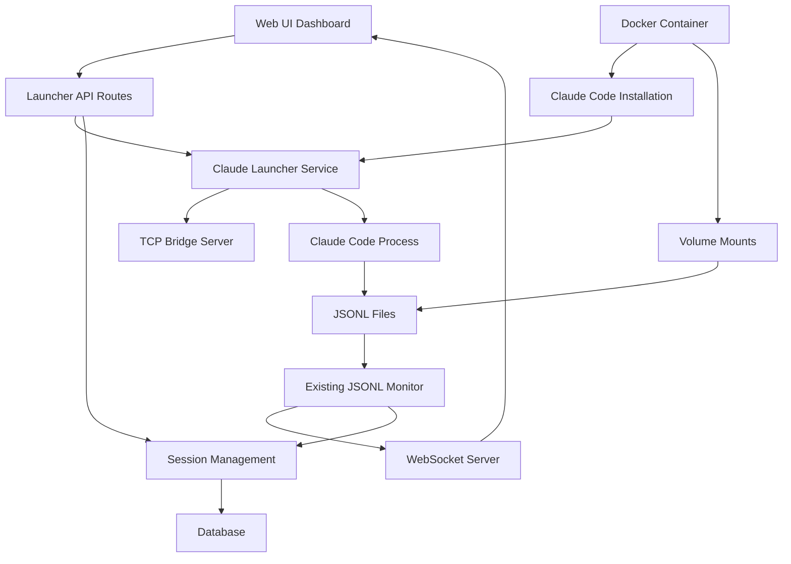

# Design Document

## Overview

The Docker Integration feature implements a comprehensive containerized Claude Code launcher and monitoring system. It replaces the Python-based expect TCP bridge with a native TypeScript implementation, providing web-based management of Claude Code instances with automatic JSONL monitoring. The design leverages existing monitoring infrastructure while adding new launcher and TCP bridge components.

## Steering Document Alignment

### Technical Standards (tech.md)
*Note: No existing steering documents found. Following Next.js and TypeScript best practices.*

- **Framework Consistency**: Follows existing Next.js App Router patterns with API routes
- **Type Safety**: Uses Zod validation schemas consistent with existing API routes
- **Error Handling**: Leverages existing ErrorHelpers and error factory patterns
- **Database Integration**: Uses existing Prisma client and database patterns

### Project Structure (structure.md)
*Note: No existing steering documents found. Following discovered project organization.*

- **Service Layer**: Places launcher services in `lib/services/` following existing patterns
- **API Routes**: Adds new routes in `api/` directory following RESTful conventions
- **Components**: Places UI components in `src/components/` following feature-based organization
- **Type Definitions**: Extends existing types in `lib/types/` directory

## Code Reuse Analysis

### Existing Components to Leverage
- **JSONLMonitor Service**: Extends existing JSONL monitoring for launcher-created sessions
- **WebSocket Server**: Reuses existing Socket.IO infrastructure for real-time updates
- **Database Client**: Uses existing Prisma client and session management schemas
- **Error Handling**: Leverages ErrorHelpers and existing error factory patterns
- **Performance Monitoring**: Integrates with existing performance tracking wrapper
- **Authentication**: Uses existing auth API routes and middleware patterns

### Integration Points
- **Projects API**: Extends existing `/api/projects` to support launcher configuration
- **Sessions API**: Enhances existing `/api/sessions` for launcher-managed sessions
- **WebSocket Events**: Adds new event types to existing monitoring event system
- **Database Schema**: Extends existing session and project tables with launcher metadata
- **Dashboard Components**: Integrates launcher controls into existing dashboard UI

## Architecture

The architecture follows a modular microservice pattern within the monolithic Next.js application, separating launcher, monitor, and TCP bridge concerns while integrating with existing infrastructure.

### Modular Design Principles
- **Single File Responsibility**: Each service handles one specific launcher or monitoring concern
- **Component Isolation**: Launcher, TCP bridge, and monitoring components are independent
- **Service Layer Separation**: Clear separation between data access, business logic, and presentation
- **Utility Modularity**: TCP bridge and launcher utilities are reusable across components



## Components and Interfaces

### Claude Launcher Service
- **Purpose:** Manages Claude Code process lifecycle with TCP bridge integration
- **Interfaces:** 
  - `startInstance(config: LauncherConfig): Promise<InstanceInfo>`
  - `stopInstance(instanceId: string): Promise<void>`
  - `getInstanceStatus(instanceId: string): InstanceStatus`
- **Dependencies:** TCP Bridge Server, process management utilities
- **Reuses:** Existing error handling, logging, and database client

### TCP Bridge Server
- **Purpose:** Provides programmatic interface to Claude Code instances via TCP commands
- **Interfaces:**
  - `createBridge(port: number, instanceId: string): Promise<BridgeServer>`
  - `sendCommand(command: TCPCommand): Promise<void>`
  - `destroyBridge(instanceId: string): Promise<void>`
- **Dependencies:** Node.js net module, process communication
- **Reuses:** Existing logging and error handling patterns

### Launcher Management API
- **Purpose:** RESTful endpoints for instance management and configuration
- **Interfaces:**
  - `POST /api/launcher/instances` - Create new Claude Code instance
  - `GET /api/launcher/instances` - List active instances
  - `DELETE /api/launcher/instances/:id` - Stop instance
  - `POST /api/launcher/instances/:id/commands` - Send TCP commands
- **Dependencies:** Launcher Service, validation schemas
- **Reuses:** Existing API route patterns, Zod validation, performance tracking

### Instance Monitor Service
- **Purpose:** Monitors launcher-created instances and integrates with JSONL monitoring
- **Interfaces:**
  - `registerInstance(instance: InstanceInfo): Promise<void>`
  - `updateInstanceStatus(instanceId: string, status: InstanceStatus): Promise<void>`
  - `monitorInstanceHealth(): Promise<HealthReport>`
- **Dependencies:** JSONLMonitor, WebSocket Server
- **Reuses:** Existing monitoring infrastructure, database schemas

### Docker Installation Service
- **Purpose:** Handles Claude Code CLI installation and MCP tool setup in containers
- **Interfaces:**
  - `checkClaude(): Promise<InstallationStatus>`
  - `installClaude(): Promise<void>`
  - `setupMCPTools(): Promise<void>`
  - `validateAuthentication(): Promise<AuthStatus>`
- **Dependencies:** Docker environment, package managers
- **Reuses:** Existing configuration management patterns

### Dashboard Integration Components
- **Purpose:** UI components for launcher management within existing dashboard
- **Interfaces:**
  - `LauncherControls` - Instance creation and management UI
  - `InstanceList` - Display active instances with status
  - `TCPCommandInterface` - Send commands to instances
- **Dependencies:** Existing dashboard components, WebSocket client
- **Reuses:** Existing dashboard layout, styling, and real-time update patterns

## Data Models

### LauncherConfig
```typescript
interface LauncherConfig {
  projectPath: string;
  tcpPort: number;
  displayName?: string;
  autoRestart: boolean;
  environment: Record<string, string>;
  claudeArgs: string[];
}
```

### InstanceInfo
```typescript
interface InstanceInfo {
  id: string;
  config: LauncherConfig;
  processId: number;
  tcpPort: number;
  status: 'starting' | 'running' | 'stopping' | 'stopped' | 'error';
  startTime: Date;
  lastActivity: Date;
  sessionIds: string[];
}
```

### TCPCommand
```typescript
interface TCPCommand {
  type: 'send' | 'enter' | 'up' | 'down' | 'ctrl-c' | 'tab' | 'raw';
  content?: string;
  instanceId: string;
}
```

### InstallationStatus
```typescript
interface InstallationStatus {
  claudeInstalled: boolean;
  claudeVersion?: string;
  mcpToolsInstalled: boolean;
  authenticationRequired: boolean;
  errorMessages: string[];
}
```

## Error Handling

### Error Scenarios
1. **Claude Code Installation Failure**
   - **Handling:** Retry with different installation methods, provide manual instructions
   - **User Impact:** Clear error message with installation steps and container logs

2. **TCP Bridge Connection Failure**
   - **Handling:** Retry connection, fallback to direct process management
   - **User Impact:** Warning message with reduced functionality notification

3. **Authentication Required**
   - **Handling:** Detect auth requirement, provide setup instructions
   - **User Impact:** Step-by-step authentication guidance with URL and status

4. **Process Crash Recovery**
   - **Handling:** Automatic restart with backoff, preserve session state
   - **User Impact:** Notification of restart with minimal service interruption

5. **Port Conflicts**
   - **Handling:** Automatic port discovery, fallback to alternative ports
   - **User Impact:** Notification of port change with new connection details

## Testing Strategy

### Unit Testing
- **Launcher Service**: Test process management, configuration validation, lifecycle operations
- **TCP Bridge**: Test command parsing, connection handling, error scenarios
- **Installation Service**: Mock Docker environment, test installation steps
- **Key Test Cases**: Process spawning, TCP command forwarding, error recovery

### Integration Testing
- **API Endpoints**: Test launcher management routes with database integration
- **JSONL Monitoring**: Test integration between launcher and existing monitoring
- **WebSocket Integration**: Test real-time updates for launcher events
- **Database Operations**: Test instance persistence and session tracking

### End-to-End Testing
- **Docker Compose Deployment**: Test complete system startup and configuration
- **Instance Lifecycle**: Test creation, management, and termination of Claude instances
- **Authentication Flow**: Test first-time setup and authentication handling
- **Multi-Instance Scenarios**: Test concurrent instance management and monitoring