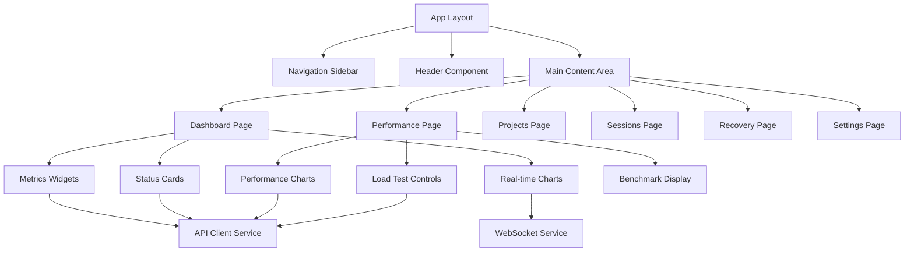

# Design Document

## Overview

The UI/UX improvement transforms Claude Monitor from a basic dashboard into a comprehensive monitoring platform. The design leverages existing Next.js architecture, React components, and TypeScript patterns while introducing a unified navigation system, enhanced visual design, and complete API integration. The solution maintains the current component-based architecture while adding professional layout management, responsive design, and accessibility features.

## Steering Document Alignment

### Technical Standards (tech.md)
*No steering documents exist. Following Next.js 15 app router conventions, React 19 patterns, and TypeScript best practices from the existing codebase.*

### Project Structure (structure.md)  
*No steering documents exist. Following the established `src/` directory structure with components, types, and app router patterns.*

## Code Reuse Analysis

The design maximizes reuse of existing infrastructure while building comprehensive UI layers on top.

### Existing Components to Leverage
- **ProjectMonitor**: Core dashboard component will be enhanced with better layout integration
- **SessionViewer**: Existing session management UI will be integrated into main navigation
- **RecoveryControls**: Current recovery interface will be enhanced with better UX patterns
- **StartupDetector**: Existing initialization logic will be preserved and enhanced

### Integration Points
- **API Routes**: All existing `/api/*` endpoints will be consumed through new UI components
- **Type System**: Existing `monitoring.ts` types will be extended for UI state management
- **Socket.IO Integration**: Current real-time infrastructure will be leveraged for live updates
- **Authentication System**: Existing auth middleware will be integrated with layout components

## Architecture

The design follows a layered architecture with clear separation between layout, page components, and feature modules.

### Modular Design Principles
- **Single File Responsibility**: Each component handles one UI concern (navigation, header, modals, charts)
- **Component Isolation**: Small, focused components that can be independently tested and maintained
- **Service Layer Separation**: UI components, API clients, and state management are clearly separated
- **Utility Modularity**: Shared utilities for formatting, validation, and UI helpers are modularized



## Components and Interfaces

### AppLayout Component
- **Purpose:** Root layout providing consistent navigation, header, and content structure
- **Interfaces:** Children props, user authentication state, navigation state management
- **Dependencies:** Next.js app router, authentication context, navigation context
- **Reuses:** Existing authentication middleware, current routing structure

### NavigationSidebar Component  
- **Purpose:** Fixed sidebar navigation with responsive collapse for mobile
- **Interfaces:** Active route highlighting, permission-based menu items, mobile toggle
- **Dependencies:** Next.js navigation hooks, authentication context
- **Reuses:** Existing route structure, authentication roles

### HeaderComponent
- **Purpose:** Top header with logo, user info, global actions, and notifications
- **Interfaces:** User profile dropdown, logout action, notification badge, theme toggle
- **Dependencies:** Authentication context, notification service
- **Reuses:** Existing auth API, user session management

### DashboardOverview Component
- **Purpose:** Main dashboard showing system health, metrics, and quick actions
- **Interfaces:** Real-time metric display, status indicators, action buttons
- **Dependencies:** Health API, performance API, WebSocket service
- **Reuses:** Existing ProjectMonitor, current API endpoints, monitoring types

### PerformanceVisualization Component
- **Purpose:** Interactive performance monitoring with charts and controls
- **Interfaces:** Chart configuration, time range selection, export functionality
- **Dependencies:** Performance API, charting library (Recharts), data formatting utilities
- **Reuses:** Existing performance API endpoints, current metric types

### ProjectManagement Component
- **Purpose:** Project listing, session management, and monitoring controls
- **Interfaces:** Project CRUD operations, session viewing, recovery actions
- **Dependencies:** Projects API, sessions API, recovery API
- **Reuses:** Existing ProjectInfo types, SessionViewer component, RecoveryControls

### RealTimeNotifications Component
- **Purpose:** Toast notifications and real-time update handling
- **Interfaces:** Notification queue, auto-dismiss, action buttons
- **Dependencies:** WebSocket service, notification context
- **Reuses:** Existing Socket.IO infrastructure, current real-time patterns

### AuthenticationFlow Component
- **Purpose:** Enhanced login/logout flows with better UX
- **Interfaces:** Form validation, loading states, error handling, redirect management
- **Dependencies:** Authentication API, form validation library
- **Reuses:** Existing login component, auth API, session management

## Data Models

### UIState Interface
```typescript
interface UIState {
  sidebarCollapsed: boolean;
  activeRoute: string;
  notifications: NotificationItem[];
  theme: 'light' | 'dark' | 'system';
  loading: Record<string, boolean>;
}
```

### NavigationItem Interface
```typescript
interface NavigationItem {
  id: string;
  label: string;
  href: string;
  icon: React.ComponentType;
  requiresAuth: boolean;
  permissions?: string[];
  badge?: number | string;
}
```

### NotificationItem Interface
```typescript
interface NotificationItem {
  id: string;
  type: 'info' | 'success' | 'warning' | 'error';
  title: string;
  message: string;
  timestamp: Date;
  actions?: NotificationAction[];
  autoClose?: boolean;
  duration?: number;
}
```

### DashboardWidget Interface
```typescript
interface DashboardWidget {
  id: string;
  title: string;
  type: 'metric' | 'chart' | 'status' | 'list';
  size: 'sm' | 'md' | 'lg' | 'xl';
  refreshInterval?: number;
  data: unknown;
  loading: boolean;
  error?: string;
}
```

## Error Handling

### Error Scenarios
1. **API Connection Failures:**
   - **Handling:** Retry logic with exponential backoff, offline mode graceful degradation
   - **User Impact:** Status indicator shows "offline", cached data displayed with timestamps

2. **Authentication Expiration:**
   - **Handling:** Automatic refresh attempt, redirect to login with return URL
   - **User Impact:** Seamless re-authentication or login prompt with progress preservation

3. **Real-time Connection Loss:**
   - **Handling:** WebSocket reconnection logic, fallback to polling for critical data
   - **User Impact:** Connection status indicator, graceful degradation to manual refresh

4. **Component Rendering Errors:**
   - **Handling:** React error boundaries isolate failures, component-level error states
   - **User Impact:** Specific component shows error message, rest of UI remains functional

5. **Data Loading Failures:**
   - **Handling:** Retry buttons, cached data fallback, error-specific messaging
   - **User Impact:** Loading skeleton replacement with retry option and error details

## Testing Strategy

### Unit Testing
- **Component Testing:** Jest + React Testing Library for all UI components
- **Hook Testing:** Custom hooks for state management and API integration
- **Utility Testing:** Data formatting, validation, and helper functions
- **Key Components:** Navigation, authentication flows, dashboard widgets, form validation

### Integration Testing
- **API Integration:** Test API client services with mock endpoints
- **Authentication Flows:** Complete login/logout cycles with session management
- **Real-time Features:** WebSocket connection handling and state synchronization
- **Key Flows:** User authentication, dashboard data loading, real-time updates

### End-to-End Testing
- **User Scenarios:** Complete user journeys through Playwright testing
- **Cross-browser Testing:** Chrome, Firefox, Safari compatibility validation
- **Responsive Testing:** Mobile, tablet, desktop layout verification
- **Accessibility Testing:** Screen reader navigation, keyboard accessibility, ARIA compliance
- **Key Scenarios:** Login → Dashboard → Performance monitoring → Project management → Recovery operations