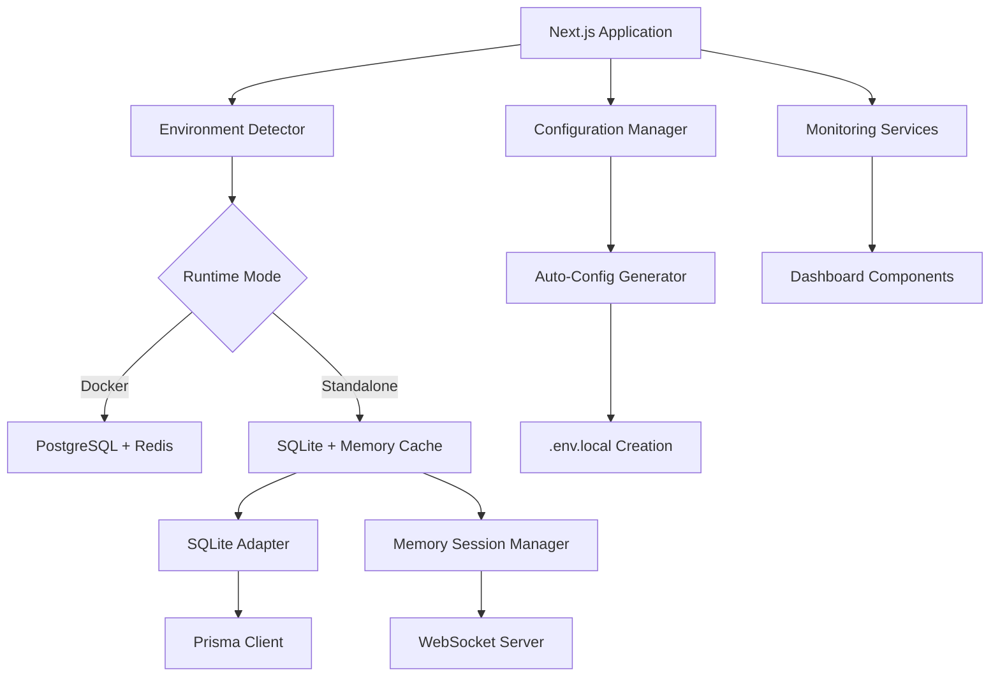

# Design Document

## Overview

The "without-docker" feature transforms the Claude Monitor Next.js application from a Docker-first architecture to a flexible solution that can run standalone using `npm run dev`. This design maintains full application functionality while replacing PostgreSQL with SQLite and Redis with in-memory data structures. The system includes automatic configuration generation, seamless database migration handling, and comprehensive development tooling to ensure a smooth transition from containerized to standalone development environments.

## Steering Document Alignment

### Technical Standards (tech.md)
The design follows existing Next.js patterns with TypeScript, Prisma ORM for database abstraction, and Socket.IO for real-time communication. We maintain the current modular architecture with clear separation between database adapters, WebSocket handlers, and configuration managers.

### Project Structure (structure.md)
Implementation preserves the current `/lib` structure for services and utilities, `/src/app` for Next.js routes, and `/prisma` for database schemas. New standalone-specific code will be organized in dedicated modules within the existing structure.

## Code Reuse Analysis

### Existing Components to Leverage
- **Prisma Client (lib/database/client.ts)**: Already supports SQLite through datasource configuration
- **Configuration System (lib/config/settings.ts)**: Extensible Zod-based validation supports new standalone mode settings
- **WebSocket Server (lib/websocket/server.ts)**: Connection management and event broadcasting remains unchanged
- **Monitoring Services (lib/services/)**: Event parsing, state detection, and performance monitoring work identically
- **Dashboard Components (src/components/)**: All React components continue functioning with same data interfaces

### Integration Points
- **Database Layer**: Prisma schema already configured for SQLite; client.ts handles connection management
- **WebSocket System**: Real-time updates continue through Socket.IO with in-memory session tracking
- **Configuration Management**: Environment variable handling extends existing patterns for standalone mode
- **API Routes**: Next.js API routes maintain consistent interfaces regardless of backing storage

## Architecture

The standalone architecture maintains the current three-tier structure while introducing adaptive components that automatically detect and configure the appropriate backing services based on runtime environment.

### Modular Design Principles
- **Single File Responsibility**: Database adapters, cache managers, and configuration handlers isolated in focused modules
- **Component Isolation**: Environment detection, storage adapters, and session managers as independent, testable units
- **Service Layer Separation**: Data persistence, business logic, and presentation layers remain decoupled
- **Utility Modularity**: File system helpers, environment detection, and validation utilities in separate modules



## Components and Interfaces

### Environment Detection Service
- **Purpose:** Detect runtime environment and configure appropriate adapters
- **Interfaces:** `detectEnvironment(): 'docker' | 'standalone'`, `configureAdapters(mode: string): void`
- **Dependencies:** Process environment, file system access, configuration manager
- **Reuses:** Existing configuration validation patterns from lib/config/settings.ts

### Standalone Configuration Generator  
- **Purpose:** Auto-generate .env.local files and SQLite database setup
- **Interfaces:** `generateConfig(): Promise<void>`, `validateStandaloneSetup(): boolean`
- **Dependencies:** File system utilities, environment detection, configuration schemas
- **Reuses:** Zod validation schemas from lib/config/settings.ts

### SQLite Database Manager
- **Purpose:** Handle SQLite-specific operations and migrations
- **Interfaces:** `initializeDatabase(): Promise<void>`, `runMigrations(): Promise<void>`
- **Dependencies:** Prisma client, file system access, migration runner
- **Reuses:** Existing Prisma client patterns from lib/database/client.ts

### Memory Session Cache
- **Purpose:** Replace Redis functionality with in-memory data structures
- **Interfaces:** `set(key: string, value: any): void`, `get(key: string): any`, `broadcast(event: any): void`
- **Dependencies:** WebSocket server, session management, event broadcasting
- **Reuses:** Event broadcasting patterns from lib/websocket/server.ts

### Development Setup Assistant
- **Purpose:** Guide developers through initial setup and configuration
- **Interfaces:** `checkPrerequisites(): SetupStatus`, `runSetupWizard(): Promise<void>`
- **Dependencies:** Configuration generator, database manager, validation utilities
- **Reuses:** Error handling patterns from lib/utils/error-handler.ts

## Data Models

### Standalone Configuration Model
```typescript
interface StandaloneConfig {
  mode: 'standalone' | 'docker'
  database: {
    type: 'sqlite' | 'postgresql'
    path?: string // SQLite file path
    url?: string // PostgreSQL connection URL
  }
  cache: {
    type: 'memory' | 'redis'
    maxSessions?: number
    ttl?: number
  }
  logging: {
    level: 'DEBUG' | 'INFO' | 'WARNING' | 'ERROR'
    fileEnabled: boolean
    consoleEnabled: boolean
  }
  autoSetup: boolean
  developmentMode: boolean
}
```

### Session Cache Entry Model
```typescript
interface SessionCacheEntry {
  id: string
  projectId: string
  data: any
  timestamp: number
  ttl: number
  connections: string[] // WebSocket connection IDs
}
```

## Error Handling

### Error Scenarios
1. **SQLite Database Creation Failed:** 
   - **Handling:** Retry with different permissions, fallback to temp directory, display file system guidance
   - **User Impact:** Clear error message with file permission instructions and alternative locations

2. **Configuration File Write Failed:**
   - **Handling:** Attempt alternative locations, provide manual configuration steps, validate permissions
   - **User Impact:** Setup wizard with step-by-step manual configuration guide

3. **Memory Cache Overflow:**
   - **Handling:** Implement LRU eviction, adjust cache size, log memory usage warnings
   - **User Impact:** Performance degradation warnings with optimization suggestions

4. **WebSocket Connection Loss:**
   - **Handling:** Automatic reconnection, session state recovery, connection health monitoring
   - **User Impact:** Brief connectivity indicator, seamless reconnection

5. **Missing Development Dependencies:**
   - **Handling:** Detect Node.js version, validate npm packages, provide installation commands
   - **User Impact:** Comprehensive setup checklist with copy-paste installation commands

## Testing Strategy

### Unit Testing
- Environment detection logic with mocked process.env
- Configuration generation with temporary file systems
- Memory cache operations with various data sizes
- Database adapter switching with different connection states
- Error recovery mechanisms with simulated failures

### Integration Testing
- Complete standalone setup flow from fresh installation
- Database migration from PostgreSQL to SQLite with data preservation
- WebSocket functionality with memory-based session management
- Configuration validation across different environment setups
- Performance monitoring under memory cache constraints

### End-to-End Testing
- Full application startup in standalone mode
- Claude instance monitoring and dashboard functionality
- Real-time updates and WebSocket communication
- Multi-tab session synchronization
- Recovery actions and error handling flows